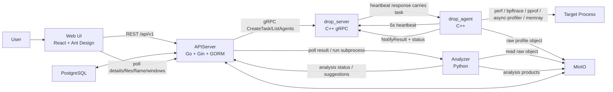
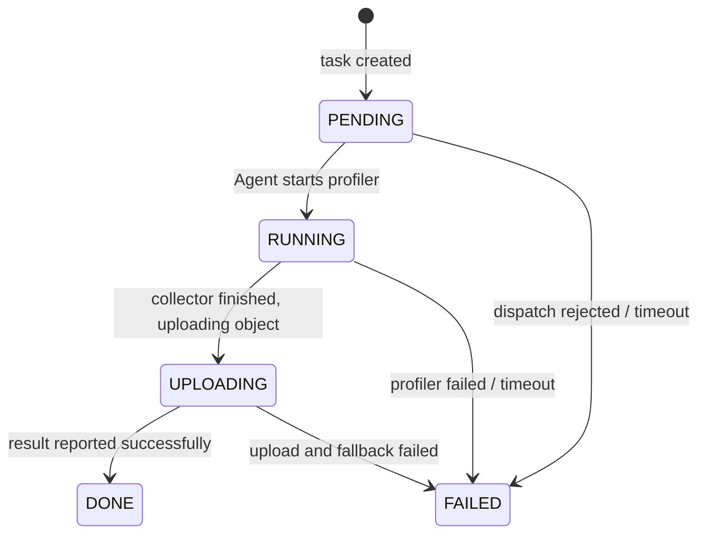
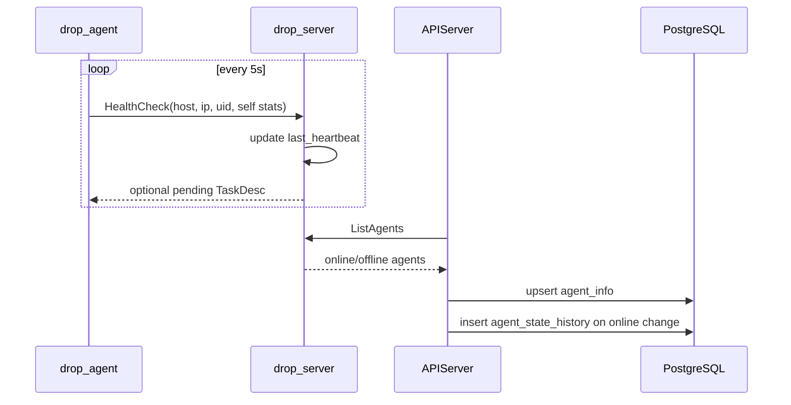
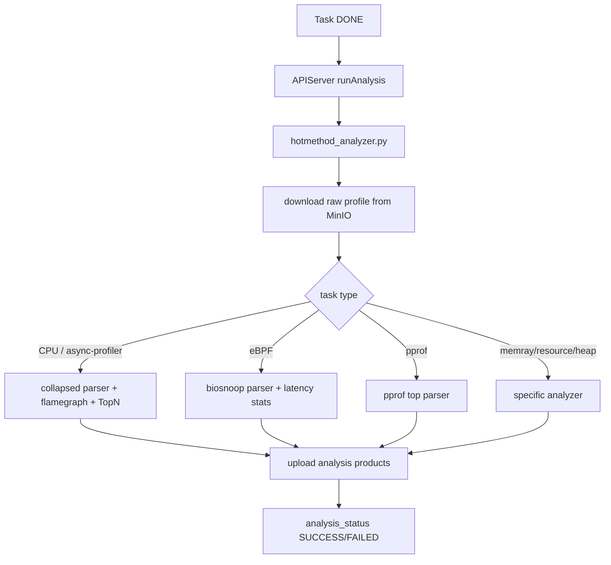
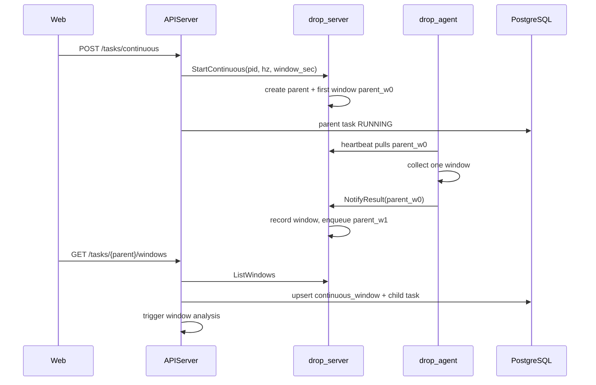
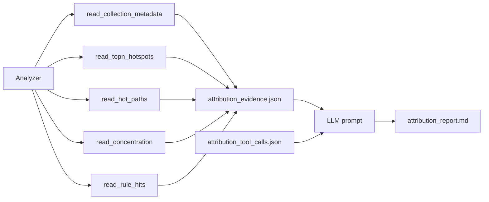

# Mini-Drop 设计文档

## 1. 目标与边界

Mini-Drop 复刻 Drop 的核心闭环：用户在 Web 上创建采集任务，Server 调度到 Agent，Agent 对 Linux 目标进程执行采样并上传原始数据，Analyzer 生成火焰图、热点函数、eBPF/pprof 等结构化结果，Web 实时展示任务状态、Agent 状态和归因报告。

本项目把交付重点放在可复现的一站式链路上：

- 本地源码模式用 `docker compose up` 启动 Web、APIServer、drop_server、drop_agent、PostgreSQL、MinIO；发布模式用 `docker compose -f docker-compose.release.yml up -d` 直接拉取 Docker Hub 镜像。
- `make demo` 在 Linux 上自动跑通一次 CPU profile，从任务创建到分析产物可展示。
- 支持一次性采集、Continuous Profiling、多采集器和可审计 LLM 归因。
- 所有任务状态迁移和 Agent 离线/恢复审计落库，Web 可查询。

Linux 真实采集依赖宿主内核能力，macOS Docker Desktop 只能做页面/API 检查，不能代表真实 perf/eBPF 验证环境。评审机建议 Ubuntu 22.04，开启 Docker、Docker Compose，并设置 `kernel.perf_event_paranoid <= 1`。

## 2. 总体架构



组件职责：

| 组件 | 职责 |
| --- | --- |
| Web | 创建任务、查看任务/Agent/时间轴、展示火焰图、TopN、eBPF、pprof、归因结果 |
| APIServer | 鉴权、任务落库、gRPC 编排、状态历史、Agent 审计、分析子进程触发、MinIO 签名 URL |
| drop_server | 维护 Agent 心跳、任务队列、内部状态、Continuous 窗口派发 |
| drop_agent | 拉取任务、执行采集器、上传采集产物、上报 RUNNING/UPLOADING/DONE/FAILED |
| Analyzer | 按任务类型解析原始采集数据，生成 Web 可展示 JSON/SVG/Markdown 产物 |
| PostgreSQL | 任务、状态迁移、Agent、审计、用户/组、设置等结构化数据 |
| MinIO | 原始 profile 和分析产物对象存储 |

选择 `APIServer + drop_server + drop_agent` 三层，是为了把产品 API、调度队列和宿主采集权限拆开：APIServer 不直接持有宿主 perf/eBPF 权限；Agent 通过 host pid namespace 和受控采集器访问目标进程；drop_server 保留轻量队列和心跳状态。

发布镜像不依赖评审机源码目录：`maijintao/mini-drop-apiserver:latest` 内置 `/app/analysis` 分析代码、Python 依赖和 flamegraph 脚本，任务完成后由 APIServer 容器直接拉起 Analyzer 子进程；`maijintao/mini-drop-analysis:latest` 仅作为独立调试/复跑镜像保留。

## 3. 任务状态机

对外主状态机遵循题目要求：



实现细节：

- `apiserver/model.HotmethodTask.status` 保存当前任务状态。
- `apiserver/model.TaskStateHistory` 保存迁移历史，字段包括 `tid/from_state/to_state/reason/change_type/created_at`。
- APIServer 创建任务后先落 `PENDING`，写入 `reason=task created and pending dispatch`。
- drop_agent 开始采集时上报 `RUNNING`，采集完成准备上传时上报 `UPLOADING`。
- drop_server 收到 `NotifyResult` 后根据错误信息写 `DONE` 或 `FAILED`。
- APIServer 的 `transitionTaskStatus` 在同一个事务里更新任务状态并写状态历史，保证可审计。
- drop_server 内部有 `DISPATCHED/TIMEOUT` 用于派发超时保护；APIServer 对外将 `DISPATCHED` 归一为 `PENDING`，将 `TIMEOUT` 归一为 `FAILED`，避免 Web 暴露额外状态。
- 分析状态独立保存为 `analysis_status=PENDING/RUNNING/SUCCESS/FAILED`，同样写入 `TaskStateHistory`，用 `change_type=analysis` 区分。

状态 reason 的来源分三类：

| 来源 | 示例 |
| --- | --- |
| APIServer | `drop_server unavailable`, `dispatch failed`, `analysis queued` |
| drop_agent | `Agent 开始执行采集任务`, `采集完成，正在上传结果到存储` |
| Analyzer | `analysis started`, `analysis completed`, 具体异常信息 |

## 4. Agent 心跳与审计

Agent 采用心跳拉任务，而不是 Server 主动推送任务：



设计取舍：

- Agent 主动心跳更适合内网/NAT/容器部署，Server 不需要维护到每个 Agent 的长连接。
- 心跳周期为 5 秒，drop_server 超过 30 秒未见心跳时将 Agent 标记离线。
- APIServer 在查询 Agent 列表和审计日志前同步 drop_server 状态；如果 `online` 发生变化，写入 `agent_state_history`。
- drop_server 日志也输出 `[AUDIT] Agent ... 离线/恢复上线`，用于现场排查；PostgreSQL 审计表用于 Web 展示和评审复核。

## 5. 采集器架构

Agent 侧用 `IProfiler` 统一采集器接口，任务通过 `profiler_type` 选择实现。任务类型和采集器组合由 APIServer 校验，避免 Web/API 下发不一致组合。

| 任务类型 | profiler | 采集语义 | 输出与展示 |
| --- | --- | --- | --- |
| CPU / perf | `perf` | Linux perf sample | `collapsed.txt`, `top.json`, `flamegraph.svg` |
| Java / async-profiler | `async-profiler`，缺失时 jstack fallback | JVM 用户态栈 | collapsed stack 火焰图 |
| eBPF / bpftrace | `bpftrace` | 内核 tracepoint/profile 探针 | `biosnoop_stats.json`，I/O/调度分布 |
| pprof CPU/Heap | HTTP pprof | Go/C++ pprof 语义 | `pprof_cpu.json`, `pprof_heap.json` |
| Python / memray | `memray attach` | Python 分配跟踪 | memray flamegraph HTML + artifact summary |
| Resource | `/proc` sampler | CPU/RSS/IO 指标 | `resource_stats.json` |
| Java Heap | hprof dump | JVM heap 快照 | heap summary |

eBPF 当前实现使用 bpftrace：

- 默认 I/O 探针使用 `tracepoint:block:block_rq_issue` 和 `tracepoint:block:block_rq_complete`，按 `(dev, sector)` 关联请求并计算延迟。
- `event=sched` 时使用 `profile:hz:99` 过滤目标 pid，生成兼容 biosnoop 分析器的 CSV 形态，用于演示调度抖动。
- bpftrace 通过 `execvp` 直接执行临时脚本，不经 shell，降低命令注入风险。
- 采集进程放在独立进程组，并由超时保护清理。

上传链路有多级兜底：优先上传 MinIO；上传失败且文件不超过 16MB 时嵌入 gRPC 结果；仍失败时报告本地文件路径并标记失败 reason。

## 6. Analyzer 与可视化产物

Analyzer 是 Python 子进程，由 APIServer 在任务完成后触发。它从 MinIO 下载原始采集对象，按 task type 分发到对应 analyzer，并把产物上传回 MinIO。



核心产物：

- CPU/Java：`collapsed.txt`, `flamegraph.svg`, `top.json`, `suggestions.md`。
- eBPF：`biosnoop_stats.json`，包含总事件、慢 I/O、方向、设备、进程维度统计。
- pprof：`pprof_cpu.json` / `pprof_heap.json`。
- 归因：`attribution_evidence.json`, `attribution_tool_calls.json`, 可选 `attribution_report.md`。

Web 展示策略：

- 火焰图优先使用 `collapsed.txt` 渲染交互图，`top.json` 作为兜底。
- 如果只有 `flamegraph.svg`，Web 会读取 SVG 文本并内嵌渲染，文件下载只是保留原始产物入口。
- 文件列表来自 `profiler/{tid}/` 和 `{tid}/` 两个前缀，兼容原始采集和分析产物。
- 任务详情页展示采集状态、分析状态、状态迁移、TopN、归因分区和采集器专属图表。

## 7. Continuous Profiling

Continuous Profiling 以父任务代表常驻采集，以窗口子任务代表一个可回看的时间片：



默认窗口为 300 秒，演示脚本使用较短窗口方便现场验证。窗口表 `continuous_window` 记录 `parent_tid/window_tid/seq/start_time/end_time/status/cos_key`。Web 的 Continuous Timeline 页面按时间轴展示窗口，点击某个窗口后复用普通任务详情的火焰图和 TopN 展示能力。

## 8. 自然语言采集

自然语言采集入口是 `POST /api/v1/tasks/nl`，Web 创建任务弹窗提供“自然语言”模式。APIServer 使用确定性规则解析用户意图，而不是把创建任务权限交给 LLM：

- 识别 CPU/perf、eBPF、pprof、memray、resource、Java heap、Continuous 等任务语义。
- 从文本中提取 PID、Agent/IP、采样时长、采样率、事件类型；未指定 Agent 时自动选择当前用户可访问的在线 Agent。
- 缺少关键参数时返回 `clarifying_question`，前端展示追问，不会静默创建错误任务。
- `execute=false` 时只返回计划，`execute=true` 时复用普通任务或 Continuous 创建链路，保证状态机、权限、审计和分析流程一致。

当前自然语言规划偏规则化，能覆盖演示和常见意图；任意进程名到 PID 的自动解析、历史时间范围语义和多工具组合仍属于后续增强。

## 9. 智能归因设计

本项目的智能归因不是让 LLM 直接读取原始 profile 后自由发挥，而是 APIServer/Analyzer 先执行本地确定性工具，把输出结构化为证据和工具调用日志，再让 LLM 只能基于证据编号生成结论。这里实现的是可审计的本地工具调用闭环，不依赖模型厂商原生 tool-calling 协议。



安全边界：

- LLM 只看到本地工具输出，不直接访问源码、宿主机、原始 profile、外部监控或网络工具。
- 每条结论、假设、追加采集建议都要求引用 `[E2.1]`、`[E3.1]`、`[E4]` 这类证据编号。
- 如果 LLM 未配置或调用失败，Analyzer 仍保存 `attribution_evidence.json` 和 `attribution_tool_calls.json`，Web 仍能展示证据。
- 如果 LLM 输出缺少必要章节或证据引用，Analyzer 会追加基于规则的证据化兜底报告。

LLM 配置由 APIServer 设置页按用户保存，运行分析时通过环境变量注入到 Analyzer 子进程；token 不返回给前端明文。

## 10. 用户、组与 Agent 可见性

系统支持注册登录、用户组和按用户隔离的设置。组 Owner 创建用户组后自动入组，可以添加/移除成员；任务、Agent 查询和 Agent 统计接口会按“本人 + 所在组 + 未分配本地 Agent”过滤，避免不同用户互相看到不可访问的采集目标。LLM base URL、模型和 token 保存在 `user_config`，按用户隔离，前端只返回脱敏状态。

Agent 心跳上报 `uid`，APIServer 同步 Agent 时写入 `agent_info.uid/gid`；Agent 在线状态变化写入 `agent_state_history`。用户组不是复杂 RBAC，而是为演示环境提供最小可用的共享边界和审计边界。

## 11. 关键取舍

| 问题 | 选择 | 原因 |
| --- | --- | --- |
| Agent 调度 | 心跳拉任务 | 适配容器和内网部署，降低 Server 连接管理复杂度 |
| 状态存储 | APIServer PostgreSQL + drop_server SQLite | PostgreSQL 面向产品查询和审计；SQLite 保留调度层本地状态 |
| 分析执行 | APIServer 调 Python 子进程 | 保持 Go API 简洁，复用 Python 数据解析生态 |
| 对象存储 | MinIO 保存原始和分析产物 | Web 下载、Analyzer 复跑、结果归档都统一走对象 key |
| 采集器扩展 | `IProfiler` 多态接口 | 新增采集器只需实现 `Record/collect_result` 并补 task type 映射 |
| Continuous | 父任务 + 窗口子任务 | 窗口可复用普通任务分析、权限、文件和详情页面逻辑 |
| 归因 | 证据 JSON + 工具调用日志 + 可选 LLM | 保证评审可验证，避免不可复核的自然语言结论 |

## 12. 工程质量与可复现性

提交历史不是一次性大提交。当前 `main` 有百余个 commit，近期提交集中在多采集器、归因、Continuous、Docker/VM 交付和演示链路修复上，例如：

- `feat: 完善自然语言采集、可审计归因和连续采样渲染`
- `feat: 完善多采集器结果渲染、连续采样时间轴与 VM 部署验证流程`
- `fix: 完善最终交付链路，修复分析轮询与火焰图渲染优先级，并补齐 Docker 构建优化`
- `fix: 规范采集器分析链路，修正 eBPF/pprof/memray 语义并补齐任务类型校验与复跑保护`

已验证命令：

```bash
cd apiserver && go test ./...
cd apiserver && go test ./server ./test -coverpkg=./server -coverprofile=/tmp/mini_drop_server.cover
cd apiserver && go tool cover -func=/tmp/mini_drop_server.cover | tail -1
cd analysis && pytest -q
cd web && npm run build
cd web && npm run test:web
docker compose config
docker compose -f docker-compose.release.yml config
```

本地验证结果：

| 项 | 结果 |
| --- | --- |
| APIServer Go 测试 | `go test ./...` 通过 |
| APIServer server 覆盖率 | `56.8%` statements |
| Analyzer 单测 | `133 passed` |
| Web build | 通过，存在 Vite 大 chunk 警告 |
| Web smoke | 7 组路由/API/表单/轮询检查通过 |
| Compose 配置 | 本地 compose 和 release compose 均可解析 |

端到端验证：

- `make demo` 会构建并启动服务，注册 demo 用户，等待在线 Agent，创建 CPU 采集任务，等待任务 DONE 和 `collapsed.txt/top.json` 产物。
- `scripts/demo_full_matrix.sh` 会创建 Python/Java/Go pprof 目标负载，覆盖 perf、async-profiler、bpftrace、pprof、resource、memray、Java heap、自然语言采集和 Continuous 窗口。
- 真实 perf/eBPF 采集必须在 Linux 上运行；macOS 不作为真实采集验收环境。

## 13. 演示路径

15 分钟演示建议按以下顺序：

1. `docker compose up` 或 `make demo` 启动，展示 Web、Agent 在线、任务列表。
2. 创建一次 CPU / perf 任务，等待状态从 `PENDING` 到 `RUNNING/UPLOADING/DONE`，打开火焰图和 TopN。
3. 打开状态迁移面板，展示每次迁移都有 reason。
4. 停止/恢复 Agent 或触发同步，展示 Agent 审计日志。
5. 运行 eBPF 任务，用 `dd`、`fio` 或 `stress-ng` 制造 I/O/调度变化，展示 eBPF 统计变化。
6. 创建 Continuous Profiling 任务，展示时间轴窗口和窗口火焰图。
7. 打开归因页，展示 `attribution_evidence.json` 的证据编号、工具调用记录和归因报告。
8. 讲一个最得意的设计：建议讲“证据化 LLM 归因”，同时说明如果重做会把 baseline 和反事实验证做成一等模型。

## 14. 如果再有 7 天

- 做真正的 historical baseline：按服务、进程、函数维度保存历史分布，用于归因时比较“本次异常”和“历史正常”。
- 把 eBPF 探针从 bpftrace 脚本升级为 libbpf CO-RE，减少运行时依赖和脚本加载不确定性。
- 增加 off-CPU、锁竞争、TCP retransmit、GC pause 等采集器，形成自动采集组合。
- 给 Continuous Profiling 增加 retention、压缩和采样率自适应，避免长期运行对象存储膨胀。
- Web 做路由级 code splitting，解决当前生产构建的大 chunk 警告。
- 把发布 compose 和 Docker Hub 镜像拉取验证做成 CI 产物，自动在干净 Ubuntu VM 中执行 `docker compose -f docker-compose.release.yml up -d` 和 `demo_full_matrix.sh`。
- 对 LLM 归因增加评测集：固定 profile 样本、标准证据、预期结论、禁止编造检查和证据引用覆盖率。
